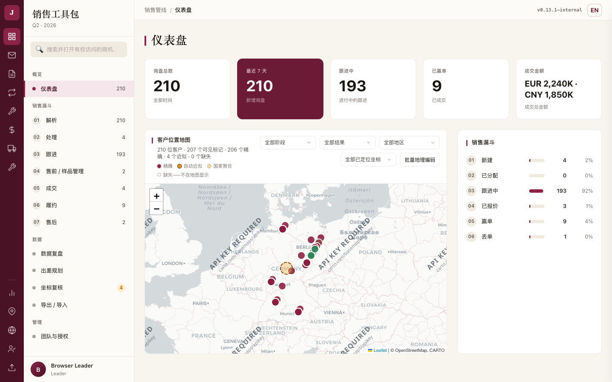
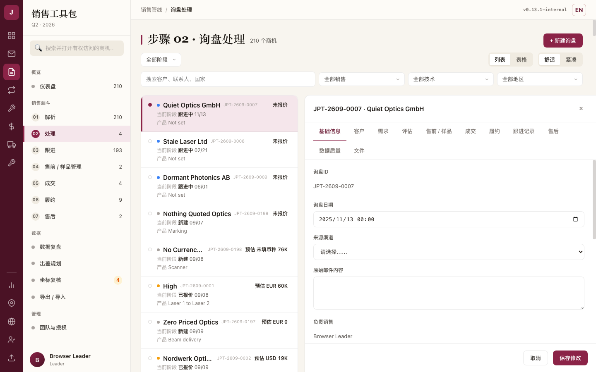
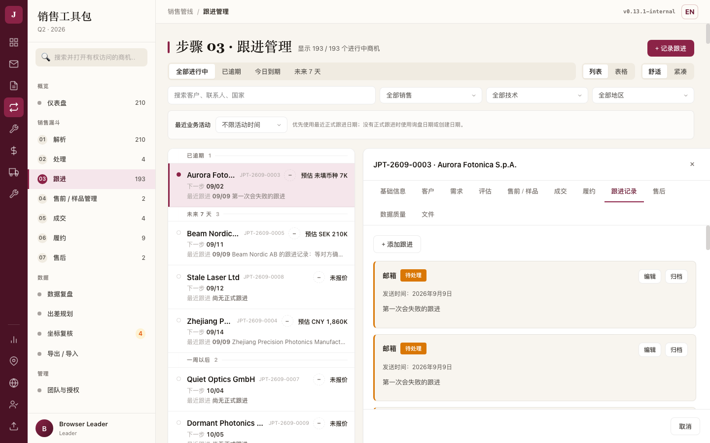
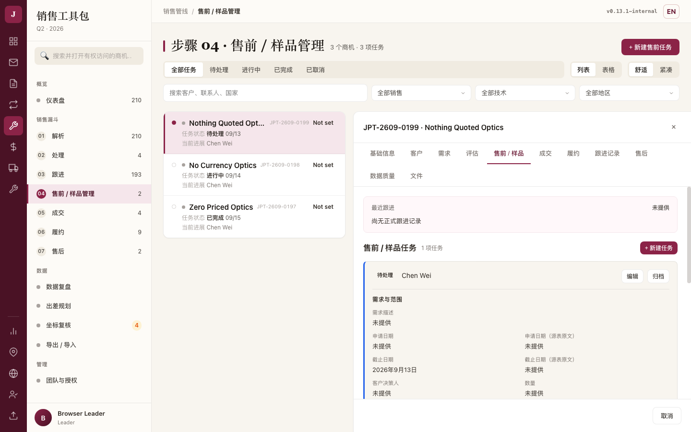
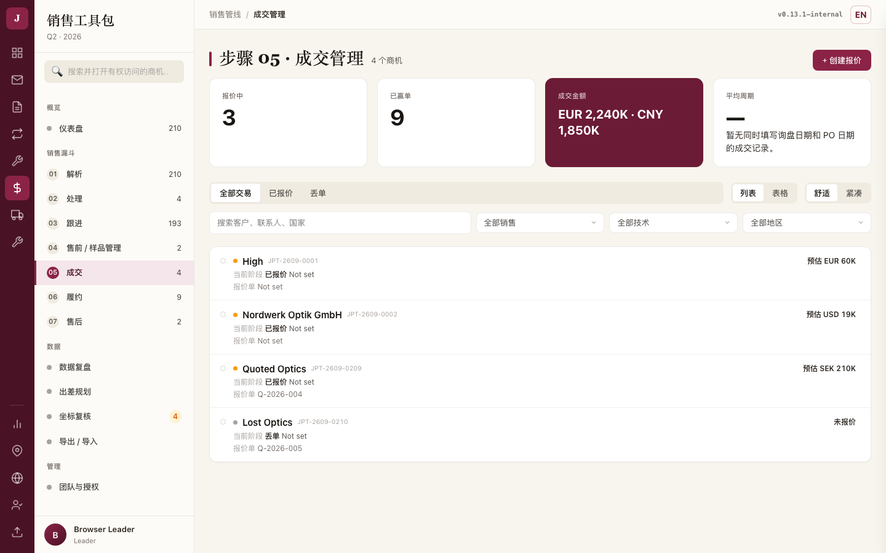
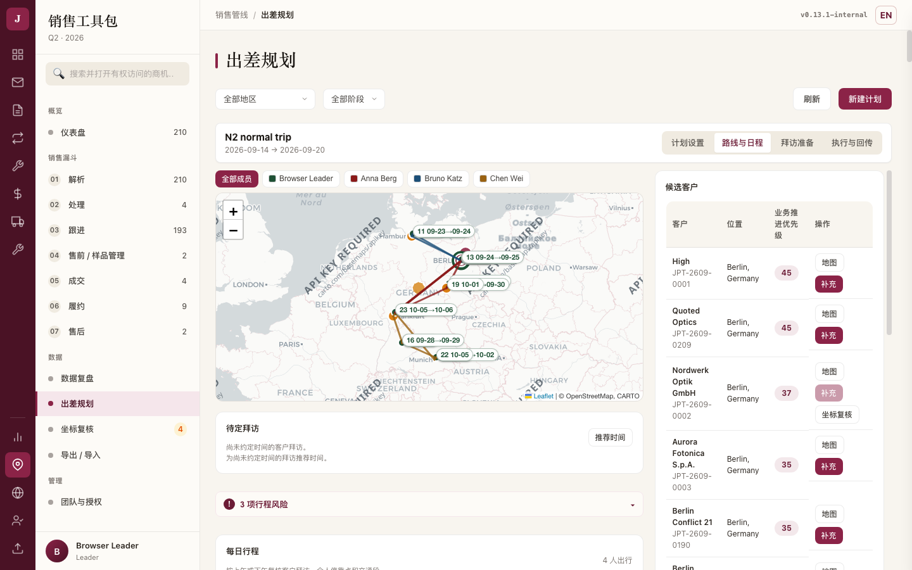
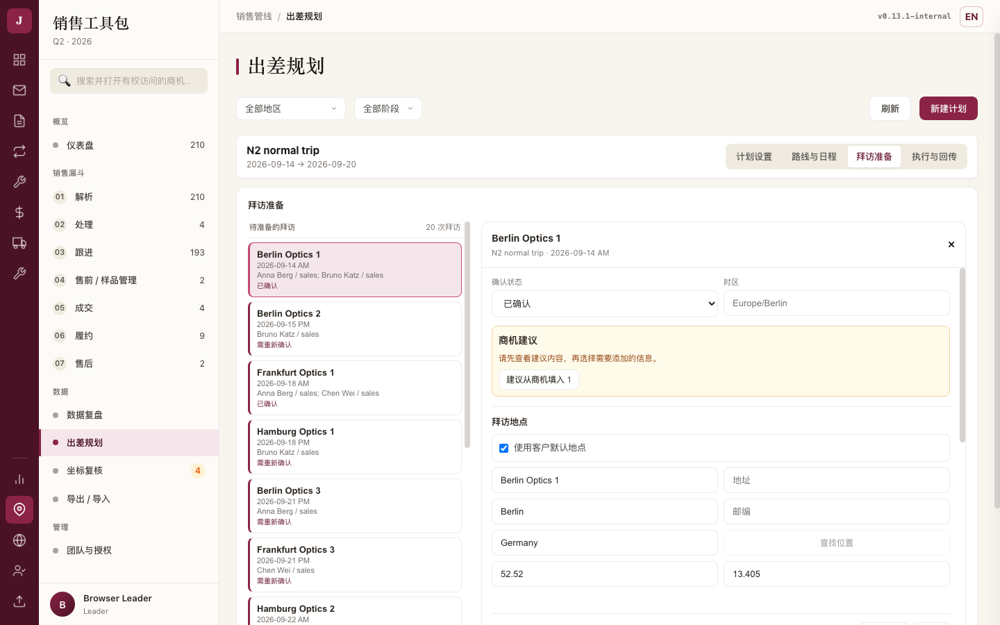
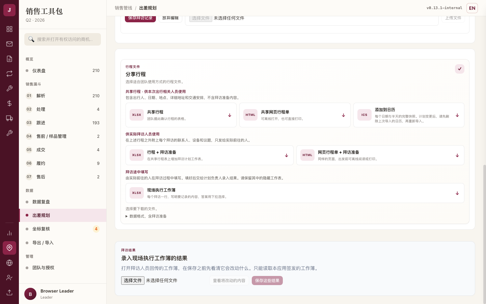
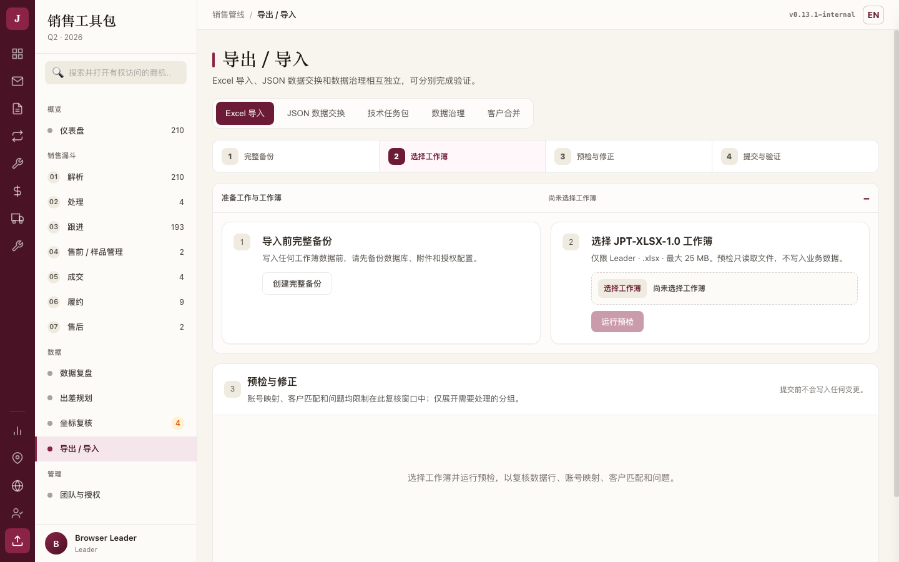
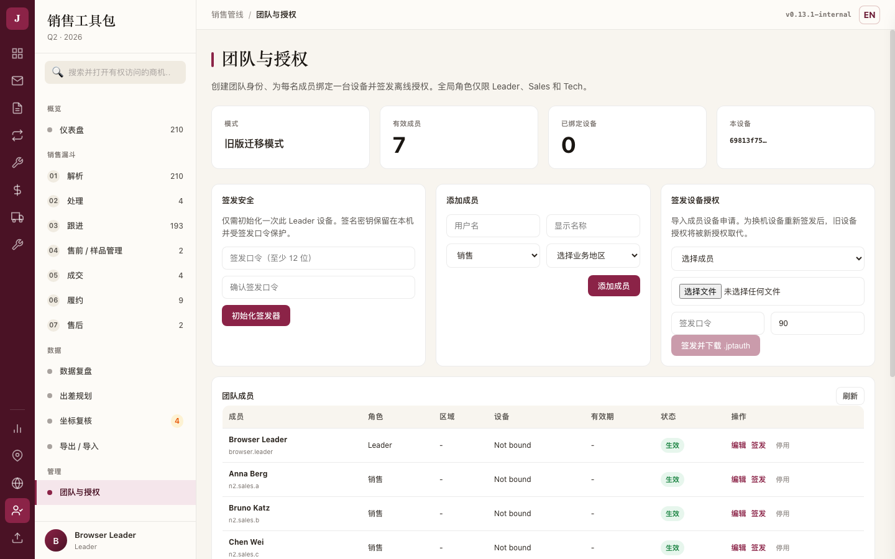

# JPT Sales Toolkit 团队使用指南

数据版本 schema 15。本文按**你要做的事**组织，不按模块编号；每一节都是从头到尾能走完的一条路。

## 先确认：你手上的包能做到哪些

| | 版本 | 内容 | 状态 |
|---|---|---|---|
| **已分发给团队** | `v0.13.4-internal` | 下面列出的全部能力 | 未签名内测 Pre-release。真实 Windows / Apple Silicon 设备的新装、覆盖升级、重启保数 **已于 2026-09-21 通过**；第二台设备的正式激活仍为 **Pending**，见 [docs/v0.13.4-validation-result.md](v0.13.4-validation-result.md) |
| **升级前的旧包** | `v0.13.2-internal` | 少了下面标 〔候选〕 的那些能力 | **已停止分发**，请升级到 0.13.4；升级前先按《团队升级操作与回退说明》做一次备份 |
| **本文标 〔候选〕 的部分** | 需要 `v0.13.4-internal` | 0.13.2 之后两轮修补：手工录入与客户匹配（同名公司都能选到）、列表完整分页、面板保存状态、出差四分区、金额按币种、翻译不再改写业务文本、读不到设备标识时在启动页直说；以及出差路线页收口——一条时间线读全程、交通段按真实日期与距离分行、日期导航与地图定位、「设置约定时间」入口，还有保存边界（一次保存只提交它自己的字段，拜访目的被别人改过时会先问你保留哪一份） | 还没升级的成员在 0.13.2 上**看不到**这些；升级到 0.13.4 之后即可照做 |

版本号在程序启动日志 `data/logs/launcher.log` 第一行。带 〔候选〕 标记的段落要装上 `v0.13.4-internal` 之后才能照做；未标记的段落在 `v0.13.2-internal` 上就能走完。**先确认自己是哪一个版本，再往下读。**

界面按钮名称与截图都取自**候选版本的真实界面**，数据是虚构的演示数据（客户、商机、行程都不是真实业务）。截图在 `guides/assets/` 下，随本文一起离线可看。

---

## 0. 〔候选〕进门第一页：仪表盘

打开程序就是仪表盘。上面五个数字里，**能点开的三个**会带你到正好是这些商机的列表：询盘总数 → 处理（全部阶段）、跟进中 → 跟进、已赢单 → 履约；下面销售漏斗的六个阶段也都能点。

**最近 7 天**和**成交金额**不可点：前者没有对应的列表，后者是金额不是一组商机。可点的会有手型和悬停变化，不可点的就是纯数字——不会有"点了却跳到别处"的情况。

**成功后应看到**：点「跟进中 193」，跟进页顶部写着"显示 193 / 193 个进行中商机"，数字对得上。

**出错时**：数据取不到时五个数字会变成"—"并显示"仪表盘数据不可用，请重试"和一个重试按钮，不会留着旧数字让你误判。

## 1. 〔候选〕一台新电脑、一个空库：录入第一条客户与商机

适用于没有历史 Excel、也没有可粘贴邮件的情况。**在 `v0.13.2-internal` 上 + New Inquiry 打开的仍是邮件解析器**，下面这条路要等候选版本发布。

1. 左侧进入 **Step 02 · Inquiry Handler**，点右上角 **+ New Inquiry**。
2. 填公司名称（必填），可一并填联系邮箱、国家、城市。
3. 点 **Search existing customers**：
   - 列表里出现的候选会显示**公司名 · 城市, 国家 · 网站**——同名公司靠这些区分，选中即挂到该客户下，不会重复建客户。
   - 没有匹配时，页面会写明"保存时将按上面填写的信息新建一个"。
4. 填 **What this enquiry is about**（必填），其余按需填。
5. 点 **Save inquiry**。保存期间表单会冻结，双击不会产生两条；失败时输入保留并显示原因，可直接重试。
6. 保存成功后自动打开这条商机的详情，可继续补充、修改；不需要了在详情里归档。

**成功后应看到**：左边是询盘列表，右边是这条商机的详情，两边指的是同一条。列表每行写着客户、商机号、当前阶段、询盘日期、产品和金额；没报过价的写"未报价"，不会写成 0。

右上角的**列表 / 表格**换看法，**舒适 / 紧凑**换行高；换看法不会改动你已经选的筛选。左上角的阶段下拉选**全部阶段**就是全部，不再只显示新建。

**出错时**：保存失败会保留你填的内容并写明原因，直接重试即可；不要重复点，页面在保存期间是冻结的。

**Tech 账号看不到这个按钮**，服务端也会拒绝——技术账号不创建商机，请让 Leader 分配任务。

## 2. 有历史数据：导入前备份、预检、修正、提交、核对

只有 Leader 能导入 XLSX。

1. **先备份**：Export / Import → 完整备份，确认备份文件生成。
2. 打开导入向导，选择工作簿。
3. **预检**：向导会列出错误、警告、跳过、冲突四类计数和明细。预检**不写库**。
4. 修正源文件或在向导里调整人员映射、客户匹配，重新预检，直到 `errors=0`。
5. 提交。提交是原子的：要么整批写入，要么一条不写。
6. 提交后核对导航数字。如果出现 **"导入已经完成，但左侧导航计数未能刷新"**，说明写入成功、页面数字是旧的——重新打开 JPT 即可，**不要重复导入**。

## 2.5 每天的三个队列：跟进、售前/样品、成交

三页是同一种用法：**左边一列选，右边办事**。左边的行只放这一页判断要用的字段，其余在右边的详情里。

**跟进**按到期分组（已逾期 / 今日到期 / 未来 7 天 / 一周以后 / 未设置日期）；一旦在"最近业务活动"里选了时间筛选（如 90 天未跟进），列表就不再分组，而是按**最久没有活动的排在前面**，标题会写明这一点。

**售前 / 样品**的行写任务状态、到期、售前负责人和当前进展。

**成交**的行写阶段、PO 日期、报价号和金额。金额一律按币种分开列，不同币种不会相加。

**成功后应看到**：点一行，右边立刻是这一条的详情，标题写着商机号和客户名；列表里同时只有一行是选中的。

**出错时**：加载失败会在列表位置写"无法加载…请重试"，与"没有符合条件的记录"是两句不同的话。

## 3. Leader：分发与回收

| 对象 | 导出什么 | 对方做什么 | 收回什么 |
|---|---|---|---|
| Sales | 定向 JSON 数据包（只含该成员负责的商机） | 本机导入、处理、回传 | JSON 结果包，Leader 预检后合并 |
| Tech | `.jpttask` 任务包（该账号全部未归档任务快照） | 导入、更新任务结果、回传 | `.jptresult`，Leader 预检后合并 |

- 导出前**必须先选接收成员**，导出包只包含该成员的数据。
- 导入端会校验接收账号；账号不符直接拒绝。
- 只有同一文件预检 `errors=0` 且权限跳过数为 0 才允许提交。
- 同一字段被两边改成不同值时**阻断**，需要人来定；不同字段可以合并。
- 结果明确区分成功、部分完成、失败三种，不会含糊。

## 4. Sales：本机怎么做

1. 收到 Leader 的 JSON 包 → Export / Import → 导入 → 预检 → 提交。
2. 在自己的队列里跟进、记录、更新阶段。
3. 需要回传时导出结果包交回 Leader。
4. **待回传事项**：本机改过但还没导出的内容，导出前不会到 Leader 那里；导出后再改的，需要再导一次。

## 5. Tech：能做什么、不能做什么

**能**：导入 `.jpttask`；查看分配给自己的任务队列；更新售前/样品与售后任务的执行结果；导出 `.jptresult` 回传。

〔候选〕队列**完整**：列表不再被第一页截断，导航数字与卡片数量口径一致。在 `v0.13.2-internal` 上，任务多于一页时列表只显示第一页。

**不能**：创建客户、创建商机、创建任务、看报价与金额、看联系人与附件。队列为空时页面会引导你导入 Leader 的任务包或联系分配人，不会给你一个用不了的"新建"按钮。

## 6. 〔候选〕出差：从建计划到结果回流

出差页面分成四块，上方始终显示**当前计划名称与起止日期**，四个页签随时可切；切页签不会丢草稿，换计划才会回到"计划设置"。

〔候选〕同一行右边还有**这条路线现在是什么状态**，以及「预览路线」和「计算并保存路线」两个按钮——
四个页签里都看得到、都能按，不用回"计划设置"。它会照实说下面几种情况：

| 它说什么 | 意思 | 你可以做什么 |
|---|---|---|
| 尚未生成路线 | 这个计划还没算过 | 预览路线；计算并保存 |
| 有未保存的行程修改 | 你改了设置/时长/交通，还没预览 | 预览路线；计算并保存 |
| 正在看预览，尚未保存 | 眼前这份是预览，库里还不是它 | 计算并保存 |
| **修改已保存，路线需要重新计算** | 你改的东西（比如拜访地点、参与人、日期）已经存进去了，但它把原来算好的路线作废了 | 就地点「计算并保存路线」 |
| 路线已保存 | 可以导出 | 导出；继续编辑 |
| 路线已保存，但有 N 处安排不可行 | 存是存住了，但有约好的拜访赶不到、有人撞车或返程超期 | 看风险条逐条处理 |
| 正在处理… | 有一次预览或保存还在跑 | 等它结束，不用重复点 |

「计算并保存路线」是**重新算一遍再写进去**，不是把眼前的预览原样存下来。

如果你有一份没保存完的拜访准备、个人停靠或执行记录，这两个按钮会暂时不可用，旁边会写明是哪一份，
并给一个「去处理」——点它会带你回到那份编辑器并把光标放进去。它不会替你提交任何东西。

1. **计划设置**：计划名称、起止日期、出行团队（逐个添加现有账号，可为每人单独设出发地/返回地/出发日期）、计划历史。经纬度收在"精确坐标"里，需要时展开。
2. **路线与日程**：候选客户、地图、自由停靠（酒店/机场/休息等）、半天日程、逐段交通。约定了时间的拜访会锁定并成为路线的支点；未约定的按上午/下午偏好和工作日安排。风险（赶不上约定时间、约在周末、与偏好冲突、返程超期、路线早于计划开始日）显示在风险条里。
3. **拜访准备**：客户人员、渠道代理陪同、JPT 参会人员、演示/PO/其他设备、议题。
   〔候选〕改**地点**、或在团队计划里改**参与人**，保存后会提示"拜访准备已保存。它同时改到了路线，需要重新计算。"——
   纯文字（议题、备注、设备）不会影响路线，也不会这么提示。
4. **执行与回传**：出发前要发的文件、带去现场的工作簿、回来要回传的结果，都在这一块。

**路线与日程**长这样：左边是按天与半天排好的团队时间线，右边是地图与候选客户；有风险时页面顶部会出现一条风险条，点开逐条写明是谁、哪一天、什么问题。

再往下是**停靠点与交通**：左边一栏是这趟行程的全部停靠点，右边一栏是它们之间的交通段。
两栏上方各有一排数字——停靠点按客户拜访点/个人停靠、时间已约定/时间可调整/尚未确定日期分类，
交通段按航班/驾车等方式分类——点其中一个数字就只看这一类，再点「全部…」回到全部。
每一行默认收起，只显示名称、时间状态、地点和日期；要改动时点行标题展开，表单和原来一样，
改完保存即可。「排序」只改变你查看的顺序，不会改动行程本身；正因为如此，按日期或名称查看时
「上移 / 下移」会停用，切回「按行程顺序」才能调整次序。

**拜访准备**是"左边选一次拜访、右边写这一次的准备"。左边每行写客户、日期与半天、参与人员、准备状态；右边顶部写着客户名和所属计划，不会把两个计划里的同一个客户搞混。

**没有指名参与人**的拜访，界面会写出全队成员的名字——那表示全队都去，不是没有人去。

**执行与回传**里，文件按用途排：共享行程（不含拜访准备）、行程+拜访准备（只给实际前往的人）、添加到日历、现场执行工作簿。

**工作簿回流**：选择带回来的工作簿 → **预检** → **提交**。
- 预检**不写库**，只列出"导出时 / 工作簿里 / 应用里现在"三列对照。
- 少填必要字段（例如写了"已拜访"却没填实际日期和半天）会被拦下，报告点名是哪一次拜访、缺哪个字段，提交按钮不可用。
- 补齐后再预检，显示"可以导入"，提交后写明导入了几次拜访、几个字段。

**成功后应看到**：该拜访在"执行与回传"里变成**已拜访**，会议记录与下一步行动回填到页面上。

**候选客户的"业务推进优先级"是什么**（口径已定，2026-09-09）：

- 它只表示**先推进哪一家**，不代表客户价值，也不代表订单潜力。
- 参与计算的是可比较的事实：进行中商机的数量、是否已报价、是否在跟进、有无售后或复购背景；坐标需要复核会扣分。
- **金额不参与计算**：预估金额与成交金额只按各自币种列出，供你自己判断；同分时也不按金额排序（同分按名称正序，顺序可预期）。
- 历史记录里没有金额**不扣分**，也不当成没有价值。
- 候选行上显示这个客户的**哪一条商机**：先看业务阶段，同阶段看最近更新时间，再用固定编号兜底；**不看有没有填金额**（历史金额填写不全，填过的不该更容易被显示）。
- 「各币种高金额商机」是独立的查看入口，看的是钱在哪里，**不影响这个优先级**。
- 拜访顺序**始终可以手工调整**，分数只是给你一个起点。

## 7. 五种文件分别是什么

| 文件 | 内容 | 给谁 | 不是什么 |
|---|---|---|---|
| **共享行程**（XLSX/网页） | 出行人、日期、地点、地址、交通 | 本次出行相关人员 | 不含拜访准备内容 |
| **行程 + 拜访准备**（XLSX/网页） | 上述 + 客户人员、陪同、参会人、设备、议题 | 只给实际前往的人 | 不要外发 |
| **现场执行工作簿**（XLSX） | 每个拜访一行，左侧只读准备内容，右侧黄色区填执行结果 | 出行人带去现场 | **只能在签发它的那台电脑上回流** |
| **JSON / 任务包**（.json / .jpttask / .jptresult） | 业务数据的定向交换 | Leader ↔ Sales / Tech | **不是备份**，不能用来恢复整库 |
| **完整备份**（.zip） | 整个数据目录 | 只给管理员 | **不是交换包**，不能当数据包发给成员 |

**把备份当交换包用，或把交换包当备份用，都会出事**——前者会把别人的数据带过去，后者恢复不了。

## 7.5 〔候选〕坐标复核与团队授权

**坐标复核**用来把自动定位的客户改成人工确认的：三个数字（待复核 / 缺少坐标 / 已核实）与四个筛选一一对应，点某一行的按钮打开修正窗，可以粘贴地址搜索、点地图、或直接填经纬度。

- 搜索服务连不上时会写明"地址搜索服务失败，可以重试，或直接在地图上标点"，仍然可以手工定位并保存。
- 保存后该客户变成"已核实"并锁定，不再被自动定位覆盖；页面上三个数字立刻更新。

**团队与授权**（Leader）：上方四张卡写当前授权模式、有效成员、已绑定设备和本机设备号（只显示前 8 位，完整值在悬停提示里）；下面是成员表与授权审计记录。

这一页只呈现现有能力，不改变认证或授权规则；签发设备授权需要签发口令，由管理员操作。

**新成员上机的完整顺序**（逐步操作与"怎么算通过"另见随包的《JPT 授权链路操作脚本与验收表》）：

1. Leader 在这一页「Add member」登记成员。
2. 成员的电脑第一次打开 JPT，在激活页「Download Device Request」导出 `.jptreq`，交给 Leader。
3. Leader 在「Issue Device Authorization」选成员、选这个 `.jptreq`、输入签发口令，下载 `.jptauth`。
4. 成员在激活页选这个 `.jptauth`，核对 Leader 那边显示的验证码，设置本机密码，「Activate This Device」。
5. 成员用新密码登录，左侧只会出现他这个角色该有的模块。

已经验证到哪一步：**第 1～5 步在开发方的隔离实例上逐条走通**，签发包被改动、换了设备、过了 90 天、
不是本组织签的，都会被拒绝。**但"换一台真实电脑激活"仍是 Pending**——同一台机器上再开一个实例
仍然是同一台设备，产品会按设计拒绝（提示这台设备在本组织已有有效授权）。在真机上跑通之前，
不要把团队升级说成"已验证"。

## 7.8 自己验一遍：团队自助验收清单

[docs/guides/05-团队自助验收清单.html](guides/05-团队自助验收清单.html) 是一张可以打印的纸：
先给一条**十分钟的快速体验路线**，再按 Leader / Sales / Tech / 出差四种角色列出每一步"怎么算通过"，
以及不通过时该把哪六项信息发回来。它不上传任何东西，也不保存你的勾选。

本文讲**怎么用**，那一页帮你确认**用得对不对**。

## 8. 出问题时

| 现象 | 含义 | 怎么办 |
|---|---|---|
| 〔候选〕**连接不上 JPT Sales Toolkit** | 程序没在运行（不是账号或密码问题） | 重新启动程序，再刷新页面 |
| 详情面板底部显示**"未保存"** | 保存被拒绝或没发出去，输入还在 | 看提示原因，改完再存；不要关页面 |
| 〔候选〕详情面板显示**"保存中…"**且表单变灰 | 请求在途，此时输入不会被保存 | 等它结束；不要重复点保存 |
| 〔候选〕**"导入已经完成，但左侧导航计数未能刷新"** | 数据写入成功，只是导航数字没更新 | 重新打开 JPT；**不要重复导入** |
| 工作簿回流提示**"不是本机签发的"** | 换了电脑 | 回到签发它的那台电脑操作 |
| 工作簿回流有冲突 | 同一字段两边都改过 | 逐条选保留哪一边，再提交 |
| 〔候选〕列表标题写**"仅显示前 {count} 条记录，请缩小筛选范围查看其余部分。"** | 数据超过一次读取上限 | 缩小筛选范围 |
| 地图空白 | 底图是外部网络资源 | 等待或检查网络；坐标与路线不受影响 |
| 升级后打不开 | 迁移失败会自动恢复原库并停止启动 | 保留 `data/logs/launcher.log` 交管理员；〔候选〕用 `--recover-backup` 恢复 `pre_upgrade_*.zip`，在 `v0.13.2-internal` 上请把备份交管理员手工恢复 |
| 〔候选〕提示**"已保存，但界面没能刷新。重新打开这条商机即可看到最新内容——不要再保存一次。"** | 写入成功了，只是屏幕没跟上 | 重新打开这条商机；**不要重复保存** |
| 〔候选〕提示**"已保存。左侧导航计数没能刷新，可能不是最新的——重新打开 JPT 即可加载最新计数。"** | 数据写入成功，只有左侧数字没更新 | 重新打开 JPT；不要重复提交 |
| 〔候选〕提示**"拜访准备已经保存，但页面没能刷新。重新打开这次拜访查看最新内容——不要再保存一次。"** | 拜访准备写进去了，只是页面没刷新 | 重新打开这次拜访；不要再存一次 |
| 〔候选〕正在保存拜访准备时，整块表单变灰、连地址搜索也点不动 | 这一次保存正在把当前内容发出去 | 等它结束再改；中途改动不会被这次保存带走 |
| 〔候选〕想换一条商机/一次拜访，页面提示先保存或取消 | 手上这一份还没落库 | 先存或先取消，再换对象；换过去之后原来的草稿不会被带走 |
| 〔候选〕导出行程时提示**"当前行程已失效。请重新预览并保存。"** | 改过停靠或成员之后日程需要重排 | 回到行程页重新预览并保存，再导出 |
| 〔候选〕登录时提示以 **"This machine could not be identified"** 开头（读不到本机设备标识；这条来自程序底层，目前只有英文） | 系统没让程序读到这台机器的标识，不是密码错 | 按提示重试；仍旧不行就把整句提示交管理员。不要改用别人的授权文件，也不要反复改密码 |

---

## 尚未验证的

**已分发的 `v0.13.2-internal`**：[docs/v0.13.2-validation-result.md](v0.13.2-validation-result.md) 里标为 **Pending** 的两条——真实 Windows 设备、真实 Apple Silicon Mac 上的新装、覆盖升级、重启与保数实测。装完请反馈：装没装上、旧数据在不在、重启后正常否、实际用起来有没有问题。

**标 〔候选〕 的部分**：源码门禁与回归通过，开发方也在隔离实例的真实浏览器里逐条走过本文描述的路径（截图即取自那次走查）。但**尚未独立复核**、**没有打包**、**没有装到真实设备上**。发布前不要按这些段落安排工作。
